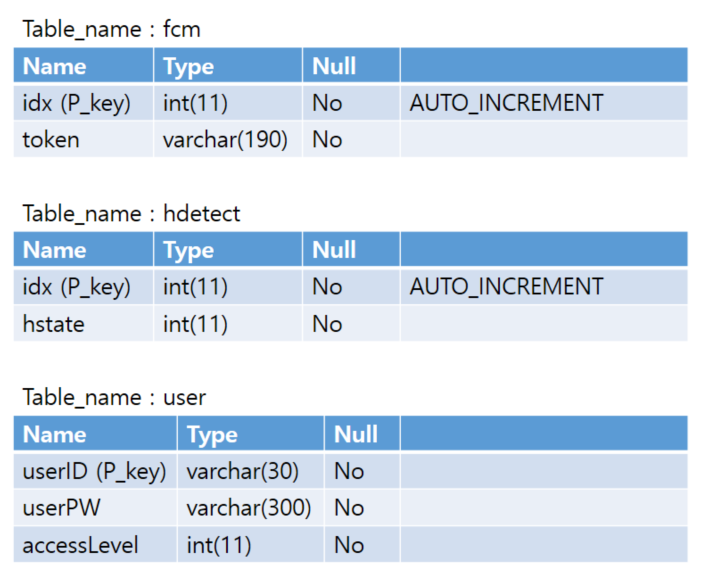
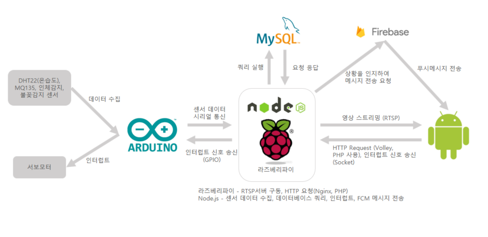

## **HomeCCTV-Project** / 정우진 (wjddnwls918)

HW 
- 라즈베리파이
- 라즈베리파이 카메라
- 아두이노
- 서보모터
- 센서들 (DHT22, MQ135, 인체감지, 불꽃감지)

SW
- 안드로이드
- Node.js
- Nginx
- PHP
- Mysql
------------------------------------------
## 프로젝트 설명 
 홈CCTV 앱과 이를 위한 하드웨어 개발을 진행했습니다.
 라즈베리파이와 아두이노가 홈CCTV앱을 위한 하드웨어이고 Node.js 언어로 라즈베리파이에서 주된 연산을 처리합니다.
 홈CCTV 앱에서는 카메라 영상 스트리밍, 카메라의 방향 조작, 실내 센서 데이터의 일별, 월별 데이터 출력(그래프, 표), 실시간 데이터 출력, 
 침입감지 모드, 화재 감지 모드를 구현했습니다. 
  

------------------------------------------
## 데이터베이스 테이블 구성

------------------------------------------

## 프로젝트 구성

### 1. 시스템 구성도

### 2. 안드로이드 구성도

------------------------------------------

[[시연 영상]](https://www.youtube.com/watch?v=d5j8SYz9WGk&feature=youtu.be)

------------------------------------------
- KOREATECH
- Computer Science Engineering
- UOC LAB
- email : wjddnwls918@naver.com
- phone : 010-9368-5828
